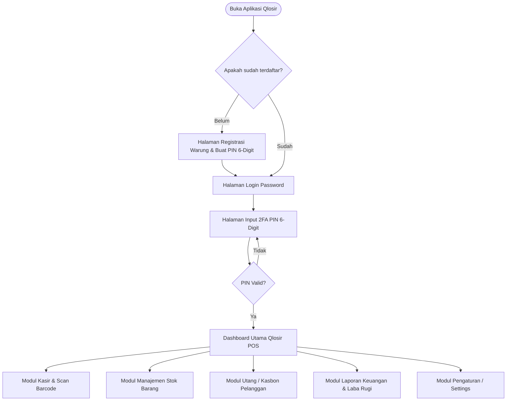

# Product Requirement Document (PRD) - Qlosir POS

**Nama Aplikasi**: Qlosir  
**Platform**: Native Android (Kotlin, Jetpack Compose, Clean Architecture)  
**Target Pengguna**: Pemilik & Kasir Warung Kelontong / Toko Kelontong  
**Versi**: 1.0.0 (MVP)  

---

## 1. Ringkasan Produk & Latar Belakang
**Qlosir** adalah aplikasi *Point of Sale* (POS) dan manajemen stok barang modern yang dirancang khusus untuk memenuhi kebutuhan pemilik warung kelontong di Indonesia. Dengan pendekatan **Offline-First**, aplikasi ini tetap dapat beroperasi secara penuh tanpa koneksi internet, memastikan transaksi kasir dan penginputan barang berjalan tanpa hambatan.

---

## 2. Tujuan Kunci (Key Goals) & Value Proposition
1. **Pencatatan Penjualan Cepat & Akurat**: Mempercepat proses transaksi kasir dengan bantuan pemindai barcode kamera HP bawaan.
2. **Kontrol Stok Barang**: Mencegah kehabisan stok dengan sistem notifikasi stok menipis (*low stock alert*).
3. **Pengelolaan Utang/Kasbon Pelanggan**: Mencatat transaksi utang warung secara rapi beserta riwayat cicilan/pelunasannya.
4. **Analisis Bisnis Sederhana**: Menyediakan laporan omset, estimasi laba/rugi, dan daftar barang paling laris.
5. **Keamanan Data & Perangkat**: Perlindungan akses aplikasi dengan mekanisme *Login* dan *2FA PIN 6-digit*.

---

## 3. Fitur Utama & Kebutuhan Spesifik (Feature Specifications)

### 3.1. Keamanan & Otentikasi Pengguna (Auth & 2FA PIN)
- **Registrasi Akun Warung**:
  - Input: Nama Warung, Nama Pemilik, Nomor Telepon / Email, Password.
  - Pembuatan 6-digit PIN Keamanan saat pendaftaran.
- **Login Akun**:
  - Masuk menggunakan Nomor Telepon/Email & Password.
- **Verifikasi 2FA PIN (Double Layer Security)**:
  - Setelah login berhasil, pengguna diwajibkan memasukkan 6-digit PIN Keamanan sebelum masuk ke Dashboard.
  - Data kredensial dan PIN disimpan terenkripsi secara lokal di perangkat menggunakan **Android Jetpack DataStore / EncryptedSharedPreferences (Security-Crypto)**.

### 3.2. Manajemen Stok & Katalog Barang
- **CRUD Produk**:
  - Atribut: Barcode/SKU, Nama Barang, Kategori, Harga Beli (Modal), Harga Jual (Eceran), Jumlah Stok, Satuan (Pcs, Kg, Renceng, dll.).
- **Kategori Barang**:
  - Pengelompokan barang (misal: Sembako, Minuman, Makanan Ringan, Bumbu Dapur).
- **Notifikasi Stok Menipis (*Low Stock Alert*)**:
  - Pengaturan ambang batas stok minimum (*reorder point*). Indikator warna dan daftar peringatan barang yang harus segera direstok.

### 3.3. Transaksi Kasir & Pemindai Barcode (POS & Barcode Scanner)
- **Pemindai Barcode Kamera (CameraX + ML Kit)**:
  - Integrasi kamera Android untuk langsung memindai barcode produk pada kemasan dan otomatis memasukkannya ke keranjang belanja.
- **Katalog & Input Manual**:
  - Pencari cepat berdasarkan nama barang / SKU, serta filter visual grid per kategori.
- **Keranjang & Kalkulasi Pembayaran**:
  - Perhitungan otomatis Total, Diskon (Opsional), Jumlah Bayar, dan Kembalian.
- **Metode Pembayaran**:
  1. **Tunai**: Kalkulasi kembalian otomatis.
  2. **QRIS / Transfer**: Konfirmasi bukti bayar/transfer.
  3. **Kasbon / Utang**: Hubungkan transaksi ke profil pelanggan tertentu.
- **Cetak Struk Thermal (Bluetooth)**:
  - Koneksi ke Printer Thermal Bluetooth portable (ukuran kertas 58mm/80mm) untuk mencetak struk transaksi.

### 3.4. Manajemen Pelanggan & Utang/Kasbon
- **Pencatatan Pelanggan**:
  - Simpan Nama Pelanggan, Nomor Telepon, dan Alamat/Catatan.
- **Buku Kasbon / Utang**:
  - Pencatatan saldo utang berjalan per pelanggan.
  - Riwayat detail barang yang diutang.
  - Fitur Pembayaran / Pelunasan utang (Cicilan maupun Lunas).

### 3.5. Laporan Keuangan & Analisis Penjualan
- **Ringkasan Harian / Bulanan**:
  - Total Omset (Penjualan Kotor).
  - Estimasi Laba Rugi (Omset dikurangi Total Harga Beli Modal).
- **Analisis Barang Terlaris (Top Selling Items)**:
  - Statistik barang yang paling sering dibeli/paling banyak terjual.

### 3.6. Menu Pengaturan & Konfigurasi (App Settings)
- **Profil Warung**: Ubah nama warung, alamat, nomor HP, serta header/footer struk belanja.
- **Pengaturan Bahasa (i18n)**: Switcher bahasa aplikasi (Bahasa Indonesia & Bahasa Inggris).
- **Koneksi Printer Bluetooth**: Pairing & manajemen printer thermal Bluetooth, tes cetak struk.
- **Pengaturan Keamanan**: Ubah Password & Ubah 2FA PIN 6-digit.
- **Aturan Stok Menipis**: Pengaturan default ambang batas stok minimum (*low stock threshold*).

---

## 4. Arsitektur & Spesifikasi Teknis

- **UI Framework**: Jetpack Compose & Material 3 (Modern Android UI)
- **Arsitektur Pattern**: Clean Architecture + MVVM (Model-View-ViewModel) + Repository Pattern
- **Penyimpanan Data (Offline-First)**: Room Persistence Library (SQLite lokal)
- **Keamanan Data**: Jetpack Security-Crypto & Encrypted DataStore
- **Kamera & Scan**: Android CameraX + Google ML Kit Barcode Scanning API
- **Konektivitas Printer**: Android Bluetooth SPP (Serial Port Profile) / POS Thermal Printer Protocol
- **Internasionalisasi (i18n)**: Dukungan multi-bahasa sejak awal inisialisasi project (*resource strings* `values/strings.xml` untuk Bahasa Indonesia & `values-en/strings.xml` untuk Bahasa Inggris).
- **Aturan Naming Codebase (Codebase Convention)**: Seluruh folder, nama file, class, method, variabel, komentar kode, dan commit message **WAJIB** menggunakan **Bahasa Inggris (English)**.

---

## 5. Alur Pengguna (User Flow)

---

## 6. Rencana Pengujian & Verifikasi (Quality Assurance)
1. **Unit Test & Integration Test**:
   - Pengujian logika perhitungan laba/rugi, saldo kasbon, enkripsi PIN 2FA, serta perpindahan bahasa i18n.
2. **Kompilasi & Build**:
   - Memastikan kelancaran Gradle build `./gradlew assembleDebug`.
3. **User Acceptance Test (UAT)**:
   - Verifikasi alur penuh pendaftaran -> login 2FA PIN -> tambah stok barang -> scan kasir -> cetak struk -> cek laporan.
